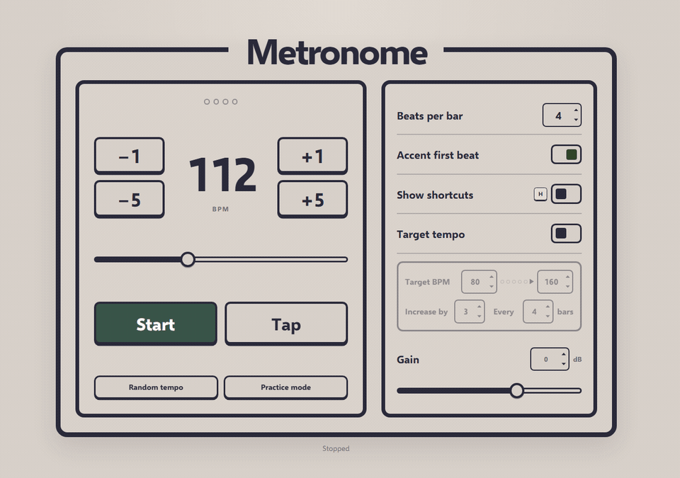

# Simple Metronome

A focused browser metronome for music practice. It includes tap tempo, configurable accents and time signatures, keyboard control, and a target-tempo mode that gradually increases the pace as you practice.

The app is built with vanilla JavaScript, [Tone.js](https://tonejs.github.io/), and [Vite](https://vite.dev/). It runs entirely on your device—there is no backend or user data collection.

<p align="center">
  <a href="https://nicklalo.github.io/simple-metronome/"><strong>Explore the simple metronome in your browser →</strong></a>
  <br /><br />
  <a href="https://github.com/NickLalo/simple-metronome/releases/latest"><strong>Download the desktop app →</strong></a>
</p>



## Quick start

You need [Node.js](https://nodejs.org/) 22.12 or newer. From a fresh clone, install the locked project dependencies and start the app with:

```bash
./install_dependencies.sh
./run.sh
```

On later runs, you only need `./run.sh`. The launcher also detects missing or outdated dependencies and runs the installer automatically, so using `./install_dependencies.sh` explicitly is optional.

By default, `./run.sh` opens the app in your browser and reloads it when files change. To start the server without opening a browser, use either form:

```bash
./run.sh -n
./run.sh --no-browser
```

You can combine these with other Vite options, for example `./run.sh -n --host 0.0.0.0`.

## Desktop app

The Electron version uses the same metronome interface and works offline. Download the latest Windows, macOS, or Linux package from [GitHub Releases](https://github.com/NickLalo/simple-metronome/releases/latest).

To build it locally and open it as a standalone desktop window:

```bash
npm run desktop:start
```

To create an installer and a portable ZIP for your current operating system:

```bash
npm run desktop:make
```

Packages are written to `out/make/`. The **Desktop builds** workflow can build Windows x64, macOS Intel and Apple Silicon, and Linux x64 versions from GitHub's Actions tab. Pushing a version tag such as `v2.0.0` builds the same packages and attaches them to a GitHub release.

On Linux and macOS, creating the portable archive uses the standard `zip` command. If it is not installed, the native DEB or DMG build still completes and the ZIP is skipped.

These builds are currently unsigned, so Windows SmartScreen or macOS Gatekeeper may show a warning. Removing that warning requires platform-specific code-signing certificates.

## Features

- Accurate browser-audio scheduling with Tone.js
- Tempo range from 40–240 BPM
- Tap tempo with smoothing across recent taps
- 1–17 beats per bar with an optional first-beat accent
- Target-tempo mode with configurable step size and bar interval
- Practice mode that starts at 80 BPM and climbs to 160 BPM
- Random-tempo practice tool
- Keyboard shortcuts and accessible native controls
- Responsive layout for desktop, tablet, and mobile screens

## Development setup

If the project lives in the WSL filesystem (for example, under `/home`), install Node inside that Linux distribution. Using a Windows `npm` executable from a WSL directory can fail because Windows command shells do not support UNC working directories.

The shell scripts use the version in `.nvmrc` when [nvm](https://github.com/nvm-sh/nvm) is available. You can also run the underlying npm commands directly:

```bash
npm ci
npm run dev
```

To verify the complete project locally:

```bash
npm run check
```

That command runs ESLint, the unit tests, and a production build.

## Commands

| Command | Purpose |
| --- | --- |
| `./install_dependencies.sh` | Select Node and install exactly the locked dependencies |
| `./run.sh` | Select Node, install dependencies if needed, start the app, and open it in a browser |
| `./run.sh -n` or `./run.sh --no-browser` | Start the app without opening a browser |
| `npm run dev` | Start the local development server without opening a browser |
| `npm run build` | Create the production site in `dist/` |
| `npm run preview` | Preview the production build locally |
| `npm run desktop:start` | Build and open the standalone desktop app |
| `npm run desktop:package` | Create an unpacked desktop application in `out/` |
| `npm run desktop:make` | Create the native installer and portable ZIP for the current OS |
| `npm run lint` | Check JavaScript quality rules |
| `npm test` | Run the unit tests |
| `npm run check` | Run linting, tests, and a production build |

## Keyboard shortcuts

| Key | Action |
| --- | --- |
| <kbd>Space</kbd> | Start or stop |
| <kbd>T</kbd> | Tap tempo |
| <kbd>A</kbd> or <kbd>←</kbd> | Decrease by 1 BPM |
| <kbd>D</kbd> or <kbd>→</kbd> | Increase by 1 BPM |
| <kbd>S</kbd> or <kbd>↓</kbd> | Decrease by 5 BPM |
| <kbd>W</kbd> or <kbd>↑</kbd> | Increase by 5 BPM |
| <kbd>0</kbd>–<kbd>9</kbd> | Enter a tempo |
| <kbd>B</kbd> | Focus beats per bar |
| <kbd>E</kbd> | Toggle the first-beat accent |
| <kbd>G</kbd> | Focus gain |
| <kbd>H</kbd> | Show or hide shortcut labels |
| <kbd>Y</kbd> | Toggle target-tempo mode |
| <kbd>R</kbd> | Choose a random tempo from 80–160 BPM |
| <kbd>P</kbd> | Start practice mode |

Keyboard shortcuts pause while a form control is focused. Press <kbd>Escape</kbd> to leave the current control.

## Target-tempo mode

Target-tempo mode increases the tempo after the configured number of completed bars until it reaches the target. The starting tempo is restored when playback stops, making it easy to repeat the same practice run.

The default configuration starts at 80 BPM and increases the tempo by 3 BPM every 4 bars until it reaches 160 BPM.
