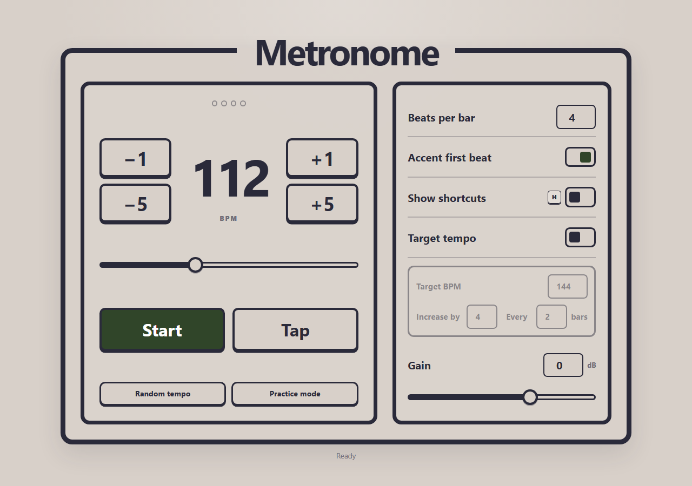

# Simple Metronome

A focused browser metronome for music practice. It includes tap tempo, configurable accents and time signatures, keyboard control, and a target-tempo mode that gradually increases the pace as you practice.

**[Open the Simple Metronome](https://nicklalo.github.io/simple-metronome/)**

The app is built with vanilla JavaScript, [Tone.js](https://tonejs.github.io/), and [Vite](https://vite.dev/). It runs entirely in the browser—there is no backend or user data collection.



## Quick start

You need [Node.js](https://nodejs.org/) 22.12 or newer. From a fresh clone, install the locked project dependencies and start the app with:

```bash
./install_dependencies.sh
./run.sh
```

On later runs, you only need `./run.sh`. The launcher also detects missing or outdated dependencies and runs the installer automatically, so using `./install_dependencies.sh` explicitly is optional.

Vite opens the app in your default browser and reloads it when files change. You can pass Vite options through the launcher, for example `./run.sh --host 0.0.0.0`.

## Features

- Accurate browser-audio scheduling with Tone.js
- Tempo range from 40–240 BPM
- Tap tempo with smoothing across recent taps
- 1–15 beats per bar with an optional first-beat accent
- Target-tempo mode with configurable step size and bar interval
- Practice mode that starts at 80 BPM and climbs to 160 BPM
- Random-tempo practice tool
- Keyboard shortcuts and accessible native controls
- Responsive layout for desktop, tablet, and mobile screens

## Development setup

If the project lives in the WSL filesystem (for example, under `/home`), install Node inside that Linux distribution. Using a Windows `npm` executable from a WSL directory can fail because Windows command shells do not support UNC working directories.

The shell scripts use the version in `.nvmrc` when [nvm](https://github.com/nvm-sh/nvm) is available. You can also run the underlying npm commands directly:

```bash
npm ci
npm run dev
```

To verify the complete project locally:

```bash
npm run check
```

That command runs ESLint, the unit tests, and a production build.

## Commands

| Command | Purpose |
| --- | --- |
| `./install_dependencies.sh` | Select Node and install exactly the locked dependencies |
| `./run.sh` | Select Node, install dependencies if needed, and start the app |
| `npm run dev` | Start the local development server |
| `npm run build` | Create the production site in `dist/` |
| `npm run preview` | Preview the production build locally |
| `npm run lint` | Check JavaScript quality rules |
| `npm test` | Run the unit tests |
| `npm run check` | Run linting, tests, and a production build |

## Keyboard shortcuts

| Key | Action |
| --- | --- |
| <kbd>Space</kbd> | Start or stop |
| <kbd>T</kbd> | Tap tempo |
| <kbd>A</kbd> or <kbd>←</kbd> | Decrease by 1 BPM |
| <kbd>D</kbd> or <kbd>→</kbd> | Increase by 1 BPM |
| <kbd>S</kbd> or <kbd>↓</kbd> | Decrease by 5 BPM |
| <kbd>W</kbd> or <kbd>↑</kbd> | Increase by 5 BPM |
| <kbd>0</kbd>–<kbd>9</kbd> | Enter a tempo |
| <kbd>B</kbd> | Focus beats per bar |
| <kbd>E</kbd> | Toggle the first-beat accent |
| <kbd>G</kbd> | Focus gain |
| <kbd>H</kbd> | Show or hide shortcut labels |
| <kbd>Y</kbd> | Toggle target-tempo mode |
| <kbd>R</kbd> | Choose a random tempo from 80–160 BPM |
| <kbd>P</kbd> | Start practice mode |

Keyboard shortcuts pause while a form control is focused. Press <kbd>Escape</kbd> to leave the current control.

## Target-tempo mode

Target-tempo mode increases the tempo after the configured number of completed bars until it reaches the target. The starting tempo is restored when playback stops, making it easy to repeat the same practice run.

The default configuration increases the tempo by 4 BPM every 2 bars until it reaches 144 BPM.

## Deploy to GitHub Pages

The repository includes a GitHub Actions workflow that checks and builds the app before publishing it.

1. Push the repository to GitHub with `main` as the default branch.
2. Open **Settings → Pages** in the repository.
3. Set **Source** to **GitHub Actions**.
4. Push to `main` or run the **Deploy to GitHub Pages** workflow manually.

Vite uses relative production asset paths, so the site works from a project URL such as `https://username.github.io/simple-metronome/` without repository-specific configuration.

## Project structure

```text
src/
  assets/              Audio sample used by the metronome
  main.js              UI state and browser interactions
  metronome-engine.js  Tone.js scheduling and playback
  styles.css           Responsive visual design
  tempo.js             Pure tempo and target-ramp logic
tests/                  Unit tests for tempo calculations
public/                 Static favicon and documentation image
```

This project began as a local Flask application and was later simplified into a fully static browser app. Its visual direction was inspired by the straightforward, high-contrast controls of dedicated practice metronomes.
